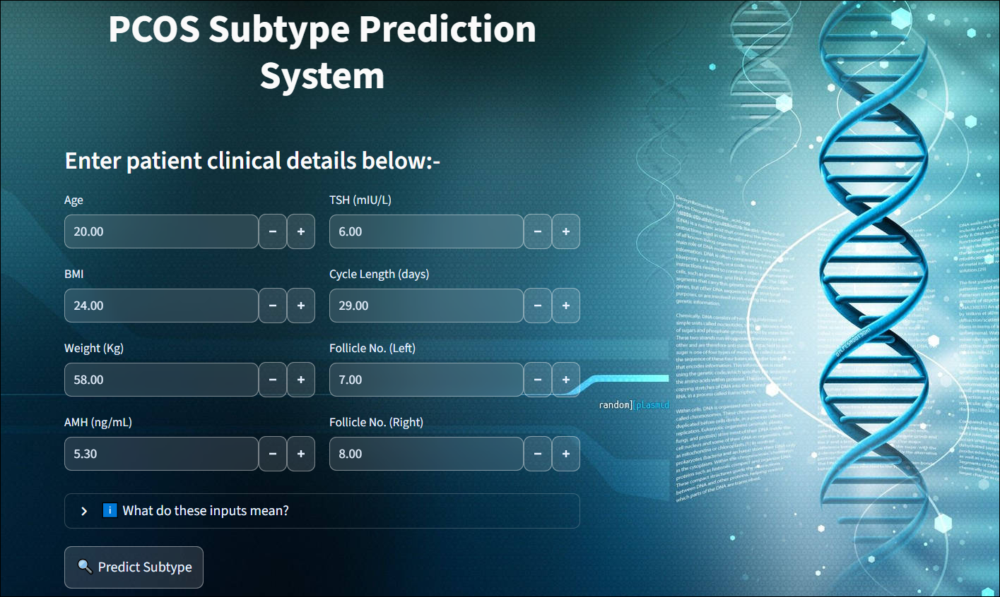
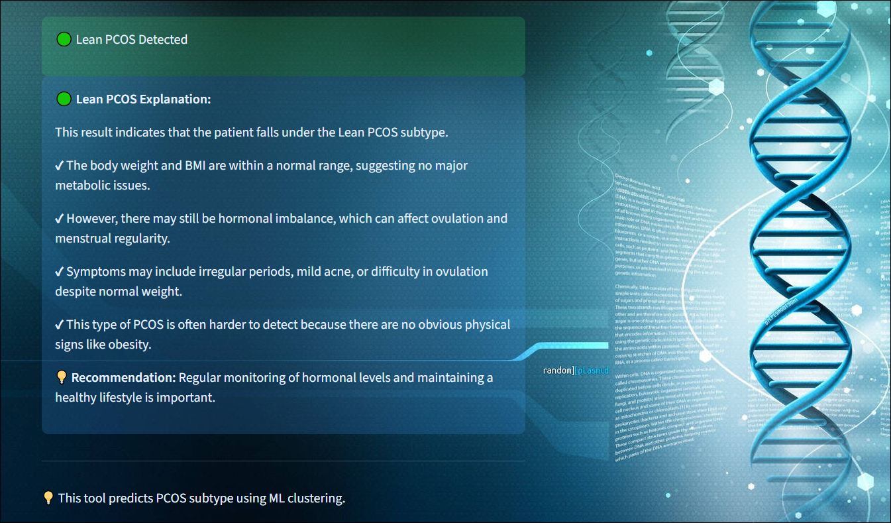
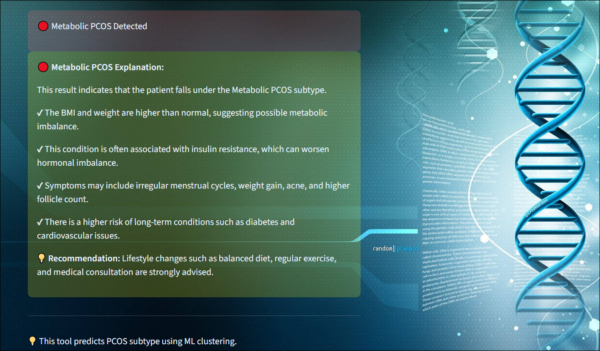
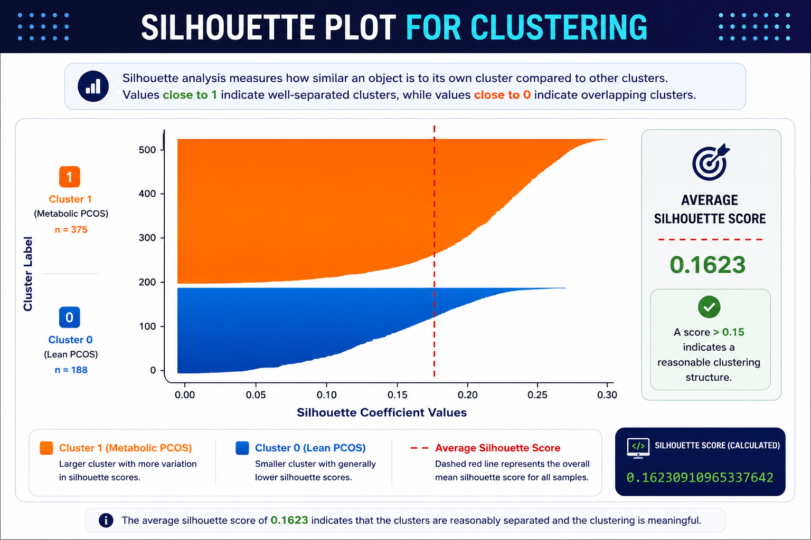
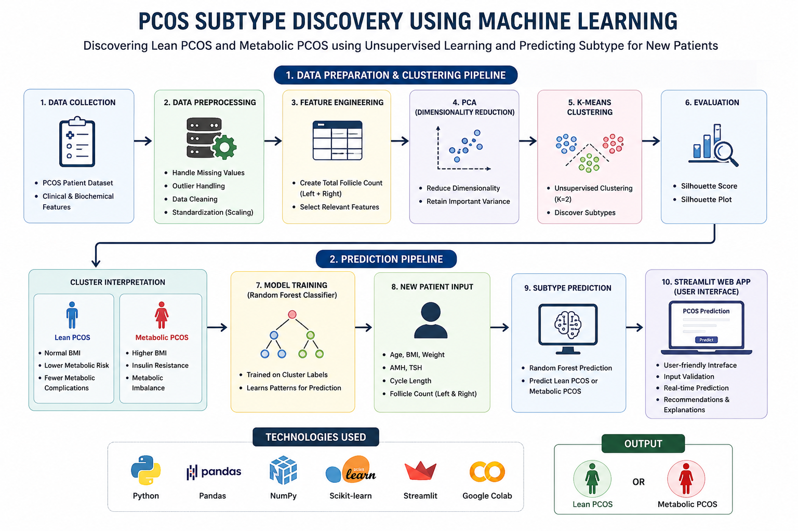

# PCOS Subtype Discovery using Machine Learning

## Overview
This project identifies hidden PCOS subtypes using Machine Learning techniques such as K-Means Clustering and Random Forest Classification. The system predicts whether a patient belongs to Lean PCOS or Metabolic PCOS based on clinical and biochemical parameters.

---

## Features
- Lean PCOS Prediction
- Metabolic PCOS Prediction
- K-Means Clustering
- PCA Dimensionality Reduction
- Silhouette Score Evaluation
- Streamlit User Interface

---

## Technologies Used
- Python
- Pandas & NumPy
- Scikit-learn
- Streamlit
- Google Colab

---

## Machine Learning Techniques
- K-Means Clustering
- PCA (Principal Component Analysis)
- Random Forest Classifier

---

## Workflow
1. Data Collection
2. Data Preprocessing
3. Feature Engineering
4. Data Normalization
5. PCA
6. K-Means Clustering
7. Silhouette Score Evaluation
8. Random Forest Prediction
9. Result Display using Streamlit

---

## Screenshots

### Input UI

### Lean PCOS Prediction

### Metabolic PCOS Prediction

### Silhouette Plot

### Workflow Diagram

---

## Results
The clustering model successfully identified two major PCOS subtypes:
- Lean PCOS
- Metabolic PCOS

The silhouette score obtained was:
0.1623

---

## Future Scope
- Integration with real-time healthcare systems
- Larger medical datasets for improved accuracy
- Deep Learning based subtype prediction
- Cloud deployment for accessibility
- Personalized healthcare recommendations
